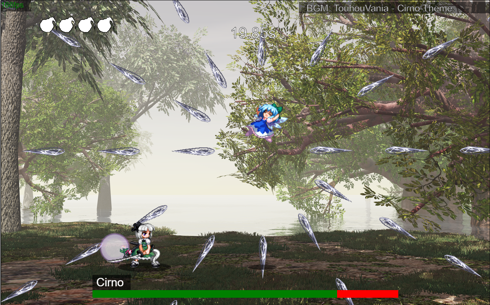

# YoumuLegacy ([Play here!](https://briannguyen636.github.io/YoumuLegacy/))

## Description

Youmu Legacy is a 2D Action Game inspired by Rogue Legacy and Hollow Knight about defeating various challenging boss fights.

Take on characters from the Touhou Project and prove your skills in the boss rush mode.

## Getting Started

### Controls
Menu navigation is done with the movement keys and Jump button.
All controls are remappable in-game. Supports both Keyboard and Controller.
### Keyboard
| Input | Action |
| -------- | ------- |
| Arrow Left/Right | Move left / right |
| Arrow Up | Jump |
| Arrow Down | Fast Fall |
| Z | Jump / Confirm |
| X | Attack |
| C | Dash |
| Esc | Pause |

### Controller (PS4 format)

| Input | Action |
| -------- | ------- |
| D-pad/Analog Left/Right | Move left / right |
| D-pad/Analog Up | Jump |
| D-pad/Analog Down | Fast Fall |
| (A) | Jump / Confirm|
| (X) | Attack |
| (B) | Dash |
| Options | Pause |

### Movement

- You have one double-jump and one air-dash
- Dash can be cancelled early by jumping, attacking, or fast-falling
- You can move and jump while attacking, but you can't dash.
- While being knocked back from damage, after a certain time has passed you can jump to recover faster.

## Authors

- [Brian Nguyen](https://github.com/BrianNguyen636)

## Acknowledgements

- All credit to Team Shanghai Alice for the Touhou Project.
- Credit to Twilight Frontier for the sprites and sfx.
- Credits to the various artists for the soundtrack.
- Thanks to Chris Marriot for "[How To Make A Web Game](https://www.youtube.com/playlist?list=PLRgsEjJNLnh7fqP4mVqP-h6fAnuOdx3l4)"
- Programming by me.
- Main menu art by me.

## Version History

### v1.01 (9/4/2023)
- Added extra start menu and Main Menu music
### v1.0 (9/3/2023)
