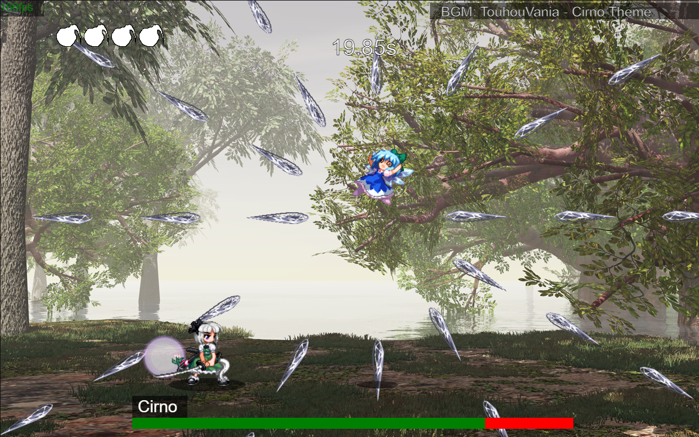

# YoumuLegacy ([Play here!](https://briannguyen636.github.io/YoumuLegacy/))

## Description

Youmu Legacy is a 2D Action Game about defeating various challenging boss fights.

Take on characters from the Touhou Project and prove your skills.

## Getting Started

### Controls

| Input                  | Action                  |
|------------------------|-------------------------|
| `A, D`                 | Walk left / right       |
| `W, SPACE`             | Jump                    |
| `S`                    | Crouch / fast fall      |
| `CLICK`                | Use selected item       |
| `CLICK (empty hand)`   | Interact with furniture |
| `CLICK (with weapon)`  | Shoot weapon            |
| `CLICK (with pickaxe)` | Mine blocks             |
| `TAB`                  | Toggle inventory        |
| `ESC`                  | Exit menu               |
| `1-9, SCROLL`          | Select hotbar item      |
## Authors

- [Brian Nguyen](https://github.com/BrianNguyen636)

## Version History

### v1.0 (9/3/2023)
